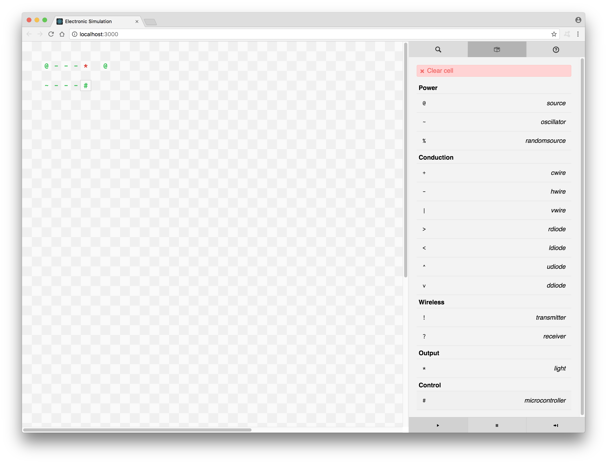

# Electronic Simulation


## Getting started:
Run the following commands (You'll need to install NodeJS beforehand):

```
git clone https://github.com/Zac-Garby/electronic-sim
cd electronic-sim
npm install
npm start
```

Or, you can just go to [this url](https://zac-garby.github.io/electronic-sim/).

## TODO:
 - [ ] Clean code up a bit
 - [ ] Organise CSS into separate files
 - [ ] Add help page
 - [ ] Add more components:
  - [x] Random power source (`%`)
  - [ ] Logic gates (and, or, not)
  - [ ] Micro-controllers
  - [x] Add wireless connections
 - [ ] Make component-list groups drop-downs
 - [x] Remove radix warnings from the oscillator class
 - [x] Have multiple choosable colours for the light
 - [ ] Add testing

## Misc.
_This project was bootstrapped with [Create React App](https://github.com/facebookincubator/create-react-app)._
